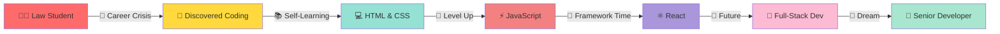

<div align="center">
  
</div>

<div align="center">
  
</div>

<div align="center">
  
</div>

---


## 🎭 About This Coding Wizard


```javascript
const badr = {
    pronouns: "He" | "Him",
    location: "📍 Casablanca, Morocco 🇲🇦",
    plotTwist: "⚖️ → 💻 (Yes, I swapped law books for VS Code!)",
    currentMission: "Building the web, one commit at a time 🚀",
    
    code: ["JavaScript", "HTML", "CSS", "TypeScript", "React"],
    askMeAbout: ["web dev", "tech", "career change", "memes"],
    technologies: {
        frontEnd: {
            js: ["React", "Vanilla JS"],
            css: ["Tailwind", "Bootstrap", "Sass"]
        },
        backEnd: {
            js: ["Node.js", "Express (learning)"]
        },
        tools: ["Git", "GitHub", "VS Code", "Figma"],
        currentlyLearning: ["Next.js", "MongoDB", "Three.js"]
    },
    funFact: "I debug with the intensity of a lawyer in court! ⚖️🔍",
    lifePhilosophy: "Code. Coffee. Repeat. ☕💻🔁"
};
```

<br clear="both">


## 🎯 Current Quests

<div align="center">

| 🎮 Quest | 📊 Progress | 🎖️ Status |
|---------|-----------|---------|
| Master React Hooks | ████████░░ 80% | 🔥 In Progress |
| TypeScript Ninja | ██████░░░░ 60% | 💪 Getting There |
| Build Full-Stack App | ████░░░░░░ 40% | 🚀 Challenging |
| Contribute to Open Source | ██░░░░░░░░ 20% | 🌱 Started |
| Coffee Consumption | ██████████ 100% | ☕ Mastered |

</div>


## 🛠️ My Arsenal of Tools

<div align="center">

### 💪 Main Weapons


### 🎓 Currently Grinding


### 🎨 Design & Extras


</div>


## 📊 GitHub Stats Extravaganza

<div align="center">
  
  
</div>

<div align="center">
  
  
</div>


## 🏆 Trophy Cabinet

<div align="center">
  
</div>


## 🎬 My Coding Journey

<div align="center">


```mermaid
graph LR
    A[👨‍🎓 Law Student] -->|🤔 Career Crisis| B[💭 Discovered Coding]
    B -->|📚 Self-Learning| C[💻 HTML & CSS]
    C -->|🚀 Level Up| D[⚡ JavaScript]
    D -->|🎯 Framework Time| E[⚛️ React]
    E -->|🔮 Future| F[🌟 Full-Stack Dev]
    F -->|🎊 Dream| G[🦄 Senior Developer]
    
    style A fill:#ff6b6b
    style B fill:#ffd93d
    style C fill:#95e1d3
    style D fill:#f38181
    style E fill:#aa96da
    style F fill:#fcbad3
    style G fill:#a8e6cf
```

</div>


## 🎨 Featured Projects (Coming Soon!)

<div align="center">
  
  <a href="#">
    
  </a>
  <a href="#">
    
  </a>

</div>

<div align="center">
  
</div>


## 🎪 Fun Zone

<div align="center">

### 💭 Random Dev Quote


### 😂 Dev Meme of the Day


### 🎵 Spotify Playing (When I Code)


</div>


## 🐍 Watch My Contributions Get Eaten!

<div align="center">
  
</div>


## 💬 Random Developer Wisdom

<div align="center">

| 🎯 Lesson | 📝 What I Learned |
|-----------|-------------------|
| **Day 1** | "Hello World" is harder than it looks 😅 |
| **Week 1** | CSS is like magic... black magic 🪄 |
| **Month 1** | JavaScript makes HTML come alive! 🎉 |
| **Month 3** | Git conflicts are real battles ⚔️ |
| **Month 6** | React hooks changed my life 🎣 |
| **Now** | Still learning, still loving it! ❤️ |

</div>


## 🌐 Connect With Me

<div align="center">
  
  <a href="https://www.linkedin.com/in/badr-bourki-6b70a3223">
    
  </a>
  <a href="mailto:badrbourki456@gmail.com">
    
  </a>
  <a href="https://github.com/badr-bourki">
    
  </a>
  
  <br><br>
  
  <a href="https://www.instagram.com/bourki_badr">
    
  </a>
  <a href="https://www.facebook.com/profile.php?id=100060181301461">
    
  </a>
  
</div>

<div align="center">
   <em><b>I love connecting with different people</b> so if you want to say <b>hi, I'll be happy to meet you more!</b> 😊</em>
</div>


## 📈 Contribution Graph

<div align="center">
  
</div>


## 🎊 Some Coding Humor

<div align="center">
  
  
  <br>
  
  **Me explaining my code to other developers:**
  
  
  
  <br>
  
  **Me when my code works on the first try:**
  
  
  
</div>


## 🎯 2025 Goals

- [x] ~~Transition from Law to Tech~~ ✅
- [x] ~~Master HTML, CSS, JavaScript~~ ✅
- [ ] 🔥 Build 10 React Projects
- [ ] 💪 Contribute to 5 Open Source Projects
- [ ] 🚀 Land My First Developer Job
- [ ] 🌟 Get 1000+ GitHub Followers
- [ ] 📚 Write Technical Blog Posts
- [ ] 🎨 Create Portfolio Website
- [ ] ☕ Drink Less Coffee (Just Kidding!) 😄


<div align="center">
  
</div>

<div align="center">
  
</div>

<div align="center">
  
  
  
  ### Show some ❤️ by starring some of the repositories!
  
</div>


