<div align="center">
  
</div>

###

<h1 align="center">
  
</h1>

<h3 align="center">🎯 Passionate Junior Web Developer | Career Transition: Law ⚖️ → Tech 💻</h3>

###

<div align="center">
  
</div>

###

## 👨‍💻 About Me

```javascript
const badr = {
    location: "Casablanca, Morocco 🇲🇦",
    currentRole: "Junior Web Developer",
    background: "Law Graduate transitioning to Tech",
    code: ["HTML5", "CSS3", "JavaScript", "Git"],
    currentlyLearning: ["React", "TypeScript", "Node.js", "Tailwind CSS"],
    goals: "Building responsive and user-friendly web applications",
    funFact: "I debug with console.log() and I'm not ashamed! 😄"
};
```

###

## 📊 GitHub Statistics

<div align="center">
  
  
</div>

###

<div align="center">
  
</div>

###

<div align="center">
  
</div>

###

## 🛠️ Tech Stack

### Frontend Development
<div align="center">
  
</div>

### Tools & Technologies
<div align="center">
  
</div>

### Currently Learning
<div align="center">
  
</div>

###

## 🎯 Current Focus

- 🔭 Working on building responsive web applications
- 🌱 Learning **React**, **TypeScript**, and **Node.js**
- 👯 Looking to collaborate on **Open Source Projects**
- 💬 Ask me about **HTML, CSS, JavaScript, and Web Development**
- 📫 How to reach me: **badrbourki456@gmail.com**
- ⚡ Fun fact: **From courtrooms to code editors - embracing the digital transformation!**

###

## 💼 Professional Journey

```mermaid
graph LR
    A[Law Graduate ⚖️] --> B[Career Transition 🔄]
    B --> C[Learning Web Development 📚]
    C --> D[Junior Web Developer 💻]
    D --> E[Building Projects 🚀]
    E --> F[Open Source Contributor 🌟]
```



###

## 🌐 Connect With Me

<div align="center">
  <a href="mailto:badrbourki456@gmail.com">
    
  </a>
  <a href="https://www.linkedin.com/in/badr-bourki-6b70a3223" target="_blank">
    
  </a>
  <a href="https://www.instagram.com/bourki_badr" target="_blank">
    
  </a>
  <a href="https://www.facebook.com/profile.php?id=100060181301461" target="_blank">
    
  </a>
  <a href="https://github.com/badr-bourki" target="_blank">
    
  </a>
</div>

###

## 💡 Random Dev Quote

<div align="center">
  
</div>

###

<h3 align="center">
  
</h3>

###

<div align="center">
  
  
  
</div>

###

<div align="center">
  
</div>
